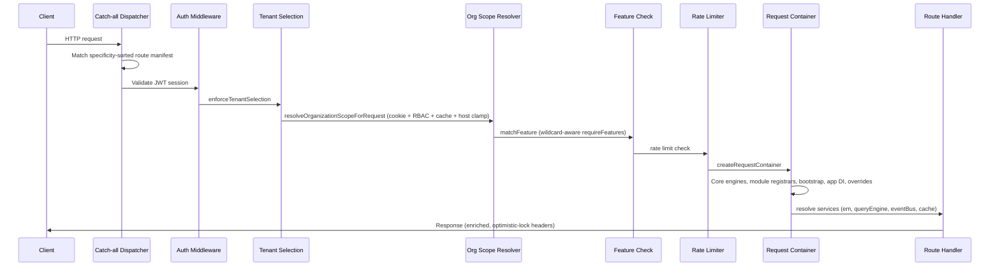

# Architecture Overview

Open Mercato is built on a modular monorepo architecture where business features live in self-contained modules, auto-discovered by a code generator and wired together through per-request dependency injection.

## Module System

Each feature module lives under `src/modules/<module>/` (in `packages/core/` or `apps/mercato/src/modules/` for app-specific modules). A module is a directory with convention-based subdirectories:

```
src/modules/customers/
├── api/              # API route handlers (makeCrudRoute, custom routes)
├── backend/          # Next.js backend admin pages (server components)
├── frontend/         # Public-facing frontend pages
├── subscribers/      # Event subscribers (persistent/ephemeral)
├── workers/          # Background queue workers
├── widgets/          # UI widget injection definitions
├── data/
│   ├── entities.ts   # MikroORM entity definitions
│   └── migrations/   # Per-module database migrations
├── acl.ts            # RBAC feature definitions
├── events.ts         # Event declarations (createModuleEvents)
├── di.ts             # Awilix DI registrar
├── ce.ts             # Custom entity extensions
├── setup.ts          # Tenant init, role features, seed defaults
├── search.ts         # Search configuration (fulltext/vector/token)
├── i18n/             # Locale dictionaries (en.json, de.json, es.json, pl.json)
└── index.ts          # Module metadata (id, label, version, dependencies)
```

These convention file names, their expected exports, and the directory-to-route mappings are a **frozen public contract** documented in `BACKWARD_COMPATIBILITY.md` → "Auto-Discovery File Conventions". New convention files may be added, but existing ones (and their export shapes) MUST NOT change in a breaking way.

### Auto-Discovery

The `packages/cli` code generator (`yarn generate`) scans module directories using AST-based analysis. It reads convention files (`data/entities.ts`, `acl.ts`, `events.ts`, `di.ts`, `ce.ts`, `search.ts`, `setup.ts`, etc.) and emits generated registry files under `apps/mercato/.mercato/generated/`. The generated files the app bootstrap imports include:

| File | Content |
|------|---------|
| `modules.generated.ts` | Routes, APIs, CLIs, subscribers, workers |
| `entities.generated.ts` | MikroORM entities |
| `di.generated.ts` | DI registrars |
| `entities.ids.generated.ts` | Entity ID registry |
| `search.generated.ts` | Search configurations |
| `dashboard-widgets.generated.ts` | Dashboard widgets |
| `injection-widgets.generated.ts` | Injection widgets |
| `injection-tables.generated.ts` | Injection tables |
| `ai-tools.generated.ts` | AI tool definitions |
| `modules.cli.generated.ts` | CLI module registrations |

**Run `yarn generate` after adding or modifying module files.** Never edit generated files by hand, and never import generated app bootstrap files from packages — only the app bootstrap should import and register them.

### Module Registration Layers

A module becomes active through a chain of registration layers, each owning a distinct concern:

1. **`modules.ts`** (enablement + overrides) — `apps/mercato/src/modules.ts` declares which modules are enabled (`enabledModules: ModuleEntry[]`), each with an `id`, a `from` package (`@open-mercato/core`, `@app`, or a custom alias), and an optional `overrides: ModuleOverrides` for disabling/replacing contracts.
2. **`index.ts`** (metadata) — exports `metadata: ModuleInfo` with the module `name`, `title`, `version`, `description`, `ejectable`, etc.
3. **`di.ts`** (DI registrar) — exports `register(container)` that registers/overrides services in the Awilix container (entities as values, services, optimistic-lock readers).
4. **`setup.ts`** (tenant init) — exports `setup: ModuleSetupConfig` with `defaultRoleFeatures`, `onTenantCreated`, `seedDefaults`, `seedExamples` hooks.
5. **Auto-discovered surfaces** — API routes, backend/frontend pages, events, subscribers, workers, widgets, ACL features, search configs are each discovered independently from their convention files and folded into the generated registries.

The bundled **example module** (`apps/mercato/src/modules/example/`) is **disabled by default** — its `enabledModules` entry is commented out in `apps/mercato/src/modules.ts`. It demonstrates the full `moduleOverrideExamples` override surface (routes, widgets, events, workers, ACL, DI, encryption, nav) and is re-enabled by uncommenting the entry. The companion `example_customers_sync` module is pulled in conditionally only when `example` is enabled. See [architecture/source-map.md](source-map.md) → Apps for the app-only modules.

### Conditional & Enterprise Enablement

`modules.ts` also appends modules conditionally from environment flags and the official-modules registry:

- `officialModuleEntries` (managed by `yarn official-modules`) are appended if not already present.
- `example_customers_sync` is pushed only when `example` is enabled.
- `storage_s3` is enabled by `OM_ENABLE_STORAGE_S3`.
- Enterprise modules (`record_locks`, `system_status_overlays`, and conditionally `sso`, `security` from `@open-mercato/enterprise`) are gated by `OM_ENABLE_ENTERPRISE_MODULES` and per-feature sub-flags.

## Dependency Injection (Awilix)

A per-request Awilix container is created by `createRequestContainer()` (`packages/shared/src/lib/di/container.ts`) with `InjectionMode.CLASSIC`. CLASSIC mode resolves factory dependencies by **parameter name** and passes them positionally, so destructuring patterns like `asFunction(({ em }) => …)` silently inject `undefined`; use plain named parameters (`asFunction((em) => …)`) or chain `.proxy()`.

### Container Construction Order

The construction order inside `createRequestContainer()` is:

1. **Core engine registrations** — `em` (a fresh `EntityManager` fork with a fresh event manager and request context), `queryEngine`, `dataEngine`, `commandRegistry`, `commandBus`, and the default OSS optimistic-lock guards (`crudMutationGuardService`, `commandOptimisticLockGuardService`, registered as `.scoped()` `asFunction`).
2. **Module DI registrars** — the registrars from `di.generated.ts` iterate and call each module's `register(container)`. A failing registrar is logged but does not abort the container (fail-open by design), so one broken module's `di.ts` cannot take down every request.
3. **Core bootstrap** — unless already bootstrapped on this container, `bootstrap(container)` from `@open-mercato/core/bootstrap` runs (or, when `OM_BOOTSTRAP_CACHE=1`, cached process-scoped services are replayed). This wires the cache, event bus, KMS/encryption, rate limiter, and search registration (see [Bootstrap Wiring](#bootstrap-wiring)).
4. **App-level DI override** — the app's `src/di.ts` `register(container)` runs last (explicitly wired via `registerAppDiRegistrar`, with a legacy `import('@/di')` fallback for apps that have not adopted explicit wiring). This is where app-level overrides and application lifecycle events are emitted.
5. **Unified override applier** — `applyDiOverridesToContainer()` applies the `entry.overrides.di` disables/replacements from `modules.ts` through the shared override surface.
6. **Tenant encryption subscriber** — re-registered on the fresh request-scoped EM when tenant data encryption is enabled.

`globalThis` is used throughout to survive HMR and module duplication in dev mode: DI registrars, the cache service, the rate limiter, the bootstrap cache, and nav-group ordering all live on `globalThis` so duplicated module instances share one process-scoped handle.

### DI Resolution

```typescript
// Inside a route handler or subscriber:
const customerService = ctx.resolve('customersService')
const cache = ctx.resolve('cacheService')
const eventBus = ctx.resolve('eventBus')
```

Modules can override any service via their `di.ts`, and apps can disable or replace services via `entry.overrides.di` in `modules.ts` without editing the original module source. The override system supports disabling, replacing, and wrapping services; the enterprise `record_locks` module is the canonical example of overriding the `crudMutationGuardService` / `commandOptimisticLockGuardService` keys via Awilix replace semantics.

## Bootstrap Wiring

`bootstrap()` (`packages/core/src/bootstrap.ts`) runs once per request container (default) and wires the process-scoped infrastructure services into the Awilix container:

- **Cache service** — registered as a process-wide singleton via `getCachedCacheService()` (default ON; `OM_CACHE_SINGLETON=off` falls back to a per-request instance). Tenant scope resolves per-call via `AsyncLocalStorage`, so the singleton holds no request-bound state. It registers a `SIGTERM`/`SIGINT` shutdown hook to close persistent handles (sqlite/redis). On failure it falls back to the `memory` strategy.
- **Event bus** — `createEventBus({ resolve, queueStrategy })`, where `queueStrategy` is `async` when `QUEUE_STRATEGY` (or legacy `EVENTS_STRATEGY`) is `async`/`redis`, else `local`. On failure it falls back to `local`, and in extreme cases to a no-op bus that deliberately omits `dispatchQueued` so the events worker fails loudly rather than silently completing a job with zero subscribers dispatched. The bus is also set as the global event bus (`setGlobalEventBus`) so `createModuleEvents().emit` works outside DI context.
- **Module subscribers** — discovered modules' subscribers are flattened and registered on the event bus; sync subscribers (`sync: true`) are additionally registered in the sync-subscriber store.
- **KMS + tenant encryption** — `createKmsService()` is registered; when `isTenantDataEncryptionEnabled()`, default encryption maps are loaded from modules and a `TenantDataEncryptionService` is built (with cache + KMS). The MikroORM encryption subscriber is registered only when KMS is healthy; an unhealthy Vault/KMS logs a warning and disables encryption until recovery.
- **Rate limiter** — `getCachedRateLimiterService()` returns a process-wide singleton (never throws; returns `null` on failure), with async init that is fire-and-forget (the Redis strategy has an in-memory insurance limiter so the first requests stay protected) and a `SIGTERM`/`SIGINT` disconnect hook.
- **Search** — `registerSearchModule(container, { moduleConfigs })` registers the search module from the global search config registry, registers `searchModuleConfigs` for the status API, and registers a search-delete event subscriber on the event bus.

The Phase 5 **bootstrap cache** (`OM_BOOTSTRAP_CACHE=1`, default OFF) caches the harvested bootstrap services on `globalThis` after the first successful `bootstrap()` so later request containers skip the `await bootstrap()` body and just re-register the cached instances. It is OFF by default because some bootstrap services close over per-request state (e.g. `tenantEncryptionService` captures the first request's `em.fork`); HMR clears the cache.

## Routing

Next.js App Router with three catch-all dispatchers:

| Dispatcher | Path | Purpose |
|-----------|------|---------|
| API | `apps/mercato/src/app/api/[...slug]/route.ts` | All `/api/*` requests |
| Backend admin | `apps/mercato/src/app/(backend)/backend/[...slug]/page.tsx` | `/backend/*` pages |
| Frontend | `apps/mercato/src/app/(frontend)/[...slug]/page.tsx` | Public-facing pages |

Each dispatcher imports a generated route manifest, registers it, then matches incoming requests by specificity-sorted patterns. The dispatchers enforce centrally:

- **Authentication** (JWT session validation)
- **RBAC feature checks** (wildcard-aware, via `matchFeature` from `@open-mercato/shared/lib/auth/featureMatch`)
- **Tenant selection** (`enforceTenantSelection()` — superadmins can cross-tenant)
- **Organization scope resolution** (from cookies + RBAC, with cache + tag invalidation)
- **Rate limiting**

`requireRoles` guards are **deprecated and ignored at runtime** (role names are mutable/spoofable); route metadata MUST use `requireFeatures` with immutable `acl.ts` feature IDs. The dispatcher warns when it encounters a `requireRoles` guard so operators migrate.

### API Route Factory

Most CRUD APIs are generated by `makeCrudRoute()` from `@open-mercato/shared/lib/crud` (the `factory.ts`). It handles:

- Zod validation
- RBAC feature gating (`requiredFeatures`)
- CRUD list/detail/create/update/delete
- Custom fields
- **Optimistic locking (default ON via `updated_at`)** — gated by `OM_OPTIMISTIC_LOCK` (set `off`/`false`/`0`/`no`/`disabled`/`none` to opt out). User-editable entities MUST include an `updated_at` column or concurrent edits are silently lost; the `optimistic-lock-editable-entities.test.ts` guard fails if a curated editable entity drops it.
- Response enrichers (cross-module response augmentation)
- API interceptors (before/after hooks, body/query rewriting)
- Mutation guards
- Multi-ID filtering (`?ids=uuid1,uuid2`)
- CRUD list caching
- Exporters
- Sync event emission

Custom (non-CRUD) write routes (`POST`/`PUT`/`PATCH`/`DELETE`) that do not use `makeCrudRoute` MUST wire the mutation guard registry (`runMutationGuards(...)` from `@open-mercato/shared/lib/crud/mutation-guard-registry`) before mutation logic.

## Database (MikroORM v7)

- **ORM:** MikroORM v7 with `ReflectMetadataProvider` for `@mikro-orm/decorators/legacy`
- **Database:** PostgreSQL (`pgvector/pgvector:pg17` with pgvector extension)
- **Entity management:** Process-level singleton ORM (`getOrm()`), request-scoped EM forks — `createRequestContainer()` forks `orm.em` with `clear: true, freshEventManager: true, useContext: true` so request-level subscribers (e.g. encryption) don't pile up globally
- **Entities:** Defined per-module in `data/entities.ts`
- **Migrations:** Generated and applied per-module; there is **no global schema**. Tables use plural snake_case with `<module>_` prefixes (e.g. `catalog_products`, `sales_orders`), UUID PKs, explicit FKs, and `deleted_at` for soft delete
- **No cross-module ORM relations** — modules reference each other via FK IDs + snapshots only; the module-decoupling test (`packages/core/src/__tests__/module-decoupling.test.ts`) verifies the app works when optional modules are disabled

### Connection Pool Budget

Each process gets its own MikroORM pool (`DB_POOL_MAX`, default 20), configured from env via `resolvePoolConfig()` in `@open-mercato/shared/lib/db/mikro`. Because background worker jobs each run in their own request container (one pooled connection per in-flight job), peak connection demand across all processes is additive. The invariant `web_pool_max + worker_pool_max + scheduler/overhead ≤ Postgres max_connections` (with headroom) MUST hold; violating it lets background work starve the request path. Bound worker job concurrency with `OM_WORKERS_DB_CONNECTION_BUDGET` and tune `DB_STATEMENT_TIMEOUT_MS` / `DB_LOCK_TIMEOUT_MS` as needed.

### Encryption

- Per-tenant field-level encryption via KMS
- Use `findWithDecryption()` / `findOneWithDecryption()` from `@open-mercato/shared/lib/encryption/find` — never raw `em.find()` on encrypted entities
- GDPR-sensitive fields are encrypted by default; declare them in the module's `encryption.ts` `defaultEncryptionMaps`
- Encryption maps default to tenant-scoped keys; the additive `keyScope: 'system'` option is for records that must exist before a tenant does

## Multi-Tenancy

Two-level tenancy model enforced on every business entity:

| Column | Type | Purpose |
|--------|------|---------|
| `tenant_id` | UUID | Top-level tenant isolation |
| `organization_id` | UUID | Sub-tenant organization scope |

### Organizations

- Support hierarchical trees: `parentId`, `rootId`, `ancestorIds`, `descendantIds`
- Role- and user-level visibility controls
- The `directory` module (`packages/core/src/modules/directory/`) defines `tenants` and `organizations`

### Scope Enforcement

- **Tenant selection:** `enforceTenantSelection()` — superadmins can operate cross-tenant
- **Organization scope:** Resolved from cookies + RBAC by `resolveOrganizationScopeForRequest()` (`packages/core/src/modules/directory/utils/organizationScope.ts`), cached with tag-based invalidation
- **Host binding org-scope clamp:** On a per-organization backend domain (#4271), the request `Host` authoritatively narrows organization scope — see below
- **Trusted scope in events:** Comes from `emit(..., options)` or queued job options — never from payload fields
- **AI Code Mode:** `ctx tenant/org scope` enforced on `api.request()` calls (see `scope-injection.ts` in ai-assistant)

### Host Binding Org-Scope Clamp

When `BACKEND_CUSTOM_DOMAINS_ENABLED` is on and a hostname resolves to an active `backend`-target `DomainMapping`, the hostname — not the `om_selected_org` / `om_selected_tenant` cookies — determines which organization an operator acts on. The cookies are client-set (`OrganizationSwitcher.tsx` writes `document.cookie`) and consumed by `applySuperAdminScope` before any scope resolver runs, so the clamp must be applied at two load-bearing layers:

1. **`applySuperAdminScope`** (`packages/shared/src/lib/auth/server.ts`) — applies the host binding at all three auth call sites (cookie, token, API-key paths) before the cookie override is written to `auth.tenantId` / `auth.orgId`. A conflicting scope cookie is silently discarded (it narrows scope); a session belonging to a different tenant is refused with 403 (serving it the host's org would grant scope). The `AuthContext` gains a first-class `hostBinding` field so every consumer — including the ~102 request-less scope calls — can assert it.
2. **`resolveOrganizationScopeForRequest`** (`packages/core/src/modules/directory/utils/organizationScope.ts`) — forces the mapping's org/tenant into `effectiveTenantId` and `normalizedSelectedId` before the cache key is built, and adds the bound org as an explicit cache-key component so a poisoned entry cannot be shared between a platform-host and a bound-host request. `__all__` on a bound host is a hard 4xx.

The binding is registered into `packages/shared` at bootstrap by `customer_accounts/di.ts` (shared cannot import the module where `DomainMapping` lives). The host may only ever **narrow** the scope a session already grants, never widen it — a user without permission on the bound organization gets an empty scope, not a fallback. The feature is gated by `BACKEND_CUSTOM_DOMAINS_ENABLED` (default off) and hard-fails at boot without `TRUSTED_PROXY_CIDRS`, because the base compose stack exposes the app directly on its port where any client can forge a `Host` header. See [operations/runbook.md → Per-Organization Backend Domains](../operations/runbook.md#per-organization-backend-domains) for deployment.

## Request Lifecycle

The diagram below traces a single request from the Next.js catch-all dispatcher through the cross-cutting middleware into the per-request Awilix container and the route handler.



*Request flow: dispatcher matching → auth → tenant → org scope → RBAC → rate limit → per-request Awilix container → handler.*

## RBAC (Feature-Based Access Control)

Open Mercato uses feature-based RBAC combining per-role and per-user feature flags with organization scoping.

### Feature Naming
Convention: `<module>.<action>` (e.g., `customers.people.view`, `customers.deals.create`). Features are declared per module in `acl.ts` as `features: Array<{ id, title, module, dependsOn? }>`.

### Declaration & Sync
- **`acl.ts`** — module declares available features
- **`setup.ts`** — `defaultRoleFeatures` grants features to `admin` and appropriate default roles (e.g. `employee`, portal/customer roles)
- After adding features: run `yarn mercato auth sync-role-acls` so existing tenants receive the new grants (new tenants get them during setup). Use `--tenant <tenantId>` only when targeting one tenant.

### Wildcard Matching
Features support wildcards via `matchFeature()` from `@open-mercato/shared/lib/auth/featureMatch.ts`: `*` (global wildcard) matches everything; `prefix.*` (module wildcard) matches all features starting with `prefix.` and the exact prefix itself. Never use `includes()`, `Set.has()`, or ad hoc `every(...includes(...))` for feature checks — the server authorization entrypoint is `rbacService.userHasAllFeatures(...)` or the consolidated `authorizeFeatures`/`resolveEffectiveFeatures` policy.

### Enforcement Points
- Route dispatchers (API, backend, frontend) check `requireFeatures` before handler execution
- `makeCrudRoute()` gates CRUD operations via `requiredFeatures`
- AI tools: `requiredFeatures` checked before handler runs
- Every module with guarded routes/pages MUST declare features in `acl.ts` — never ship empty `acl.ts` with `requireRoles` guards

### Customer Portal RBAC
Two-layer model in `customer_accounts` module:
1. **Role ACLs** (`CustomerRoleAcl`) — features assigned to roles
2. **User ACLs** (`CustomerUserAcl`) — per-user overrides (takes precedence)

Other modules declare `defaultCustomerRoleFeatures` in their `setup.ts` for portal features.

## Backward Compatibility & Optimistic Locking

Every auto-discovery file convention, public type, and function signature listed in `BACKWARD_COMPATIBILITY.md` is a **public contract**. Changes MUST follow the deprecation protocol (deprecate first, provide a bridge, document in `UPGRADE_NOTES.md`, reference a spec) or they are breaking changes that block merge. See `BACKWARD_COMPATIBILITY.md` for the full contract surface categories (auto-discovery files, type definitions, function signatures, DB schema).

**Optimistic locking is ON by default** (`OM_OPTIMISTIC_LOCK`, override with `off`/`false`/`0`/`no`/`disabled`/`none`). User-editable entities MUST include an `updated_at` column (`@Property({ name: 'updated_at', type: Date, onCreate: () => new Date(), onUpdate: () => new Date(), nullable: true })`) and return `updatedAt` in list/detail CRUD responses; without it, `CrudForm`'s auto-derive silently no-ops and concurrent edits are lost. Append-only logs, junction/assignment tables, session/token rows, background-job rows, and sub-resource lines guarded by a parent aggregate are exempt. The enterprise `record_locks` module overrides the OSS guard to back it with record locks.

## Key Source References

| Area | Path |
|------|------|
| Module conventions | `packages/core/AGENTS.md` |
| Shared utilities & CRUD factory | `packages/shared/AGENTS.md`, `packages/shared/src/lib/crud/factory.ts` |
| DI setup & request container | `packages/shared/src/lib/di/container.ts` |
| Core bootstrap wiring | `packages/core/src/bootstrap.ts` |
| App DI override | `apps/mercato/src/modules.ts`, `packages/create-app/template/src/di.ts` |
| Route dispatchers | `apps/mercato/src/app/api/[...slug]/route.ts`, `apps/mercato/src/app/(backend)/backend/[...slug]/page.tsx` |
| Feature matching | `packages/shared/src/lib/auth/featureMatch.ts` |
| Tenancy/Org scope | `packages/core/src/modules/directory/utils/organizationScope.ts` |
| Module setup types | `packages/shared/src/modules/setup` |
| Backward compatibility | `BACKWARD_COMPATIBILITY.md` |
| Agents guide | `AGENTS.md` (root) |
