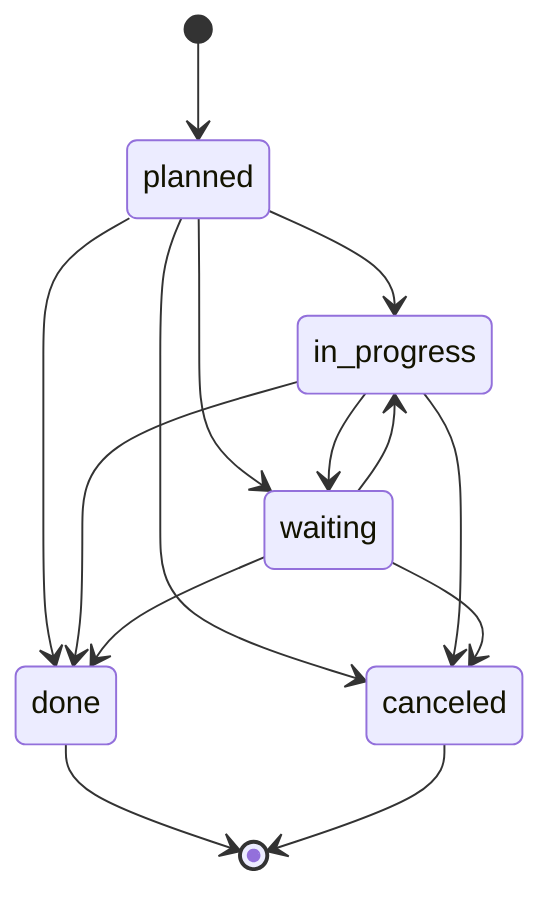

# Domain Modules

This page covers the major business domain modules in `packages/core/src/modules/`. Each module follows the convention-based structure described in [architecture/overview.md](../architecture/overview.md).

## Sales Module

**Path:** `packages/core/src/modules/sales/`
**AGENTS.md:** Present
**Dependencies:** `catalog`, `customers`, `dictionaries`

The most complex domain module. Manages the full quote-to-cash lifecycle: quotes, orders, invoices, credit memos, shipments, payments, returns, and payment allocations.

### Document Lifecycle
```
Quote → Order → Invoice
         ↓
    Shipments + Payments + Returns
```

- Quotes convert to orders; orders MUST NOT be created without a source quote (unless configured)
- Orders track shipments and payments independently
- Each entity has its own status workflow — states MUST NOT be skipped
- Credit memos created from invoices
- Returns generate line-level negative adjustments, update `returned_quantity`, recalculate order totals

### Key Business Rules

1. **Document math via DI service:** `salesCalculationService` handles all line/totals/tax calculations. Dispatches `sales.line.calculate.*` / `sales.document.calculate.*` lifecycle events so external calculators can hook in.
2. **Price resolution delegates to catalog:** Sales uses `selectBestPrice` and `resolvePriceVariantId` from the catalog module's pricing pipeline.
3. **Channel scoping:** All documents scoped to a sales channel — affects pricing tiers, document numbering sequences, admin UI visibility.
4. **Optimistic locking on the aggregate:** Sub-resources (lines, adjustments, shipments, payments, returns) guard against the **parent order's** `updated_at`, not their own. The order is the consistency boundary.
5. **Return quantity guards:** `computeAvailableReturnQuantity` caps at `min(quantity, shippedQuantity) - returnedQuantity` (if shipped) or `quantity - returnedQuantity` (if not shipped).
6. **Line total invariant:** `gross > 0 ⇒ net > 0` — if a line has positive gross but zero/missing net, the net is derived from gross and tax rate via `deriveLineNetFromGross`. Applied at every persistence site via `reconcileLinePersistedTotals`.
7. **Address snapshots:** Sales documents store their own `SalesDocumentAddress` rows (not FK to customer address) with optional `customerAddressId` reference. Preserves addresses at time of document creation even if the customer's address is later changed or deleted.
8. **Shipment quantity guard:** Cannot lower an order line's quantity below the shipped quantity (PR #4163).

### Code-Based Workflow
`workflows.ts` defines `sales.order-approval` — a USER_TASK-based approval workflow triggered by `sales.orders.created`. Steps: START → pending_approval (USER_TASK, SLA 24h) → approved/rejected (AUTOMATED, pre-conditioned by business rules) → END.

### Key DI Services
| Token | Purpose |
|-------|---------|
| `salesCalculationService` | Document math, lifecycle event dispatch |
| `taxCalculationService` | Tax calculations |
| `salesDocumentNumberGenerator` | Sequential document numbering |
| `salesOrderService` | Order-level operations |

### Source References
- `commands/documents.ts` — orders, quotes, invoices, credit memos
- `commands/shipments.ts`, `commands/returns.ts`, `commands/payments.ts`
- `commands/shared.ts` — `enforceSalesDocumentOptimisticLock`, `deriveLineNetFromGross`, `reconcileLinePersistedTotals`
- `lib/calculations.ts` — core calculation math
- `lib/returnQuantity.ts` — return availability computation
- `lib/shipments/snapshots.ts` — shipment item snapshots, `loadShippedQuantityByLine`
- `services/salesCalculationService.ts`, `services/taxCalculationService.ts`
- `workflows.ts` — order approval workflow definition

## Customers Module

**Path:** `packages/core/src/modules/customers/`
**AGENTS.md:** Present (9.3KB)
**Role:** Reference CRUD module — all new modules should copy patterns from here

Full CRM: people, companies, deals (sales opportunities), activities, todos, comments, addresses, tags, labels, entity roles, person-company links, and pipeline stages. Includes AI agents for deal analysis and account assistance.

### Data Model
| Entity | Constraints |
|--------|------------|
| People | MUST have name; email/phone optional but searchable |
| Companies | MUST have name; tax ID optional |
| Deals | MUST link to a person or company |
| Activities | MUST reference parent entity |
| Todos | MUST have assigned user |
| Comments | MUST reference parent entity |
| Addresses | Multi-address support, FK to person or company |

### Key Business Rules
1. **Custom field integration:** All CRUD operations wire custom field helpers. Custom field snapshots captured in command `before`/`after` payloads for undo support (`buildCustomFieldResetMap`).
2. **Transaction safety:** Multi-phase mutations use `withAtomicFlush(em, phases, { transaction: true })` — never interleave `em.find`/`em.findOne` between a scalar mutation and `em.flush()`.
3. **Primary address enforcement:** `enforcePrimaryAddress` sets `isPrimary = false` on all other addresses for the same entity.
4. **Deal lifecycle events:** `customers.deal.won` / `customers.deal.lost` beyond standard CRUD.
5. **Interaction projection:** `recomputeNextInteraction` recalculates the next scheduled open interaction when interactions are created, completed, canceled, or reverted. Only considers rows where `scheduled_at IS NOT NULL` and `status NOT IN (terminal set)`. Sort order: `scheduled_at ASC, priority DESC NULLS LAST, created_at ASC, id ASC`.
6. **Email integration:** `customers.email.linked` and `customers.email.visibility_changed` events for email channel linking.

### Interaction Unification (Activities → Interactions)

The customers module is undergoing a gradual unification of three legacy entities — `CustomerActivity`, `CustomerTodoLink`, and standalone tasks — into a single canonical `CustomerInteraction` model. This is controlled by per-tenant feature flags, not a hard cutover.

**Specs:**
- `.ai/specs/implemented/SPEC-046b-2026-02-27-customers-interactions-unification.md` — original unification
- `.ai/specs/2026-06-18-configurable-crm-interaction-statuses.md` — dictionary-backed interaction statuses
- `.ai/specs/2026-06-18-customers-interactions-legacy-removal.md` — planned legacy retirement

**Canonical entity (`CustomerInteraction`):** `packages/core/src/modules/customers/data/entities.ts` — supports interaction types (calls, meetings, tasks, emails), scheduling with recurrence, participants, visibility per type (`private`/`shared` for email, `team`/`public` for activities), soft-delete (`deleted_at`), pinning, and cross-module links (`external_message_id` for email channel integration).

**Feature flags** (`lib/interactionFeatureFlags.ts`): three per-tenant toggles resolved via `featureTogglesService`:
| Flag | Default | Purpose |
|------|---------|---------|
| `customers.interactions.unified` | `false` | Enables canonical-only read path |
| `customers.interactions.legacy-adapters` | `true` | Keeps legacy activity/todo bridges active |
| `customers.interactions.external-sync` | `false` | Enables external system sync |

**Legacy bridge** (`lib/legacyActivityBridge.ts`): `ensureCanonicalActivityBridge()` creates a canonical `CustomerInteraction` from a legacy `CustomerActivity` row on demand, reusing the legacy PK as the canonical ID. `resolveCanonicalActivityTargetId()` is called from the interactions API to transparently serve historical activities that haven't been migrated yet. The legacy `activities` command (`commands/activities.ts`) maps create/update inputs to the canonical interaction commands with `source: 'adapter:activity'`.

**Todo compatibility** (`lib/todoCompatibility.ts`): canonical task interactions (`interactionType: 'task'`) coexist with legacy `CustomerTodoLink` rows. `listCanonicalTodoRows()` queries `CustomerInteraction` with type `task`; `listLegacyTodoRows()` resolves legacy todo links via the Query Engine. Both map to a unified `CustomerTodoRow` shape. `mapInteractionRecordToTodoSummary()` and `mapInteractionRecordToActivitySummary()` in `lib/interactionCompatibility.ts` provide the read-model adapters.

**Configurable interaction statuses** (`lib/interactionStatus.ts`): statuses are dictionary-backed (`interaction-statuses` dictionary kind, managed via `/api/customers/dictionaries/interaction-statuses`). The open/terminal semantic is centralized in code: `isTerminalInteractionStatus()` treats `done`, `canceled`, and legacy `completed` as terminal; any unknown status counts as open (safe default for the open-activities badge). Default seeded set: `planned`, `in_progress`, `waiting`, `done`, `canceled`. The deals list enricher (`customers.deal-pipeline-state`) counts `_pipeline.openActivitiesCount` as interactions whose status is NOT in the terminal set.



Interaction status lifecycle — planned, in_progress, and waiting are open (non-terminal); done and canceled are terminal. The `complete` action always targets `done`; `cancel` always targets `canceled`.

**Interaction read model** (`lib/interactionReadModel.ts`): `hydrateCanonicalInteractions()` loads author names, deal titles, and custom field values for a set of `CustomerInteraction` rows, with optional response enrichment via `applyResponseEnrichers`. Uses `findWithDecryption` for encrypted fields.

**Calendar** (`lib/calendar/`): full calendar grid support — range queries (`from`/`to` filtering on `coalesce(occurred_at, scheduled_at, created_at)`), conflict detection (`mine`/`all` scope), recurrence expansion, preferences (weekends, conflict warnings, CRM activity visibility, event categories). Calendar preferences stored in `om.customers.calendar.preferences.v1` localStorage key. Source spec: `.ai/specs/2026-06-11-crm-calendar.md`.

**Interaction commands** (`commands/interactions.ts`): `customers.interactions.create`, `customers.interactions.update`, `customers.interactions.complete`, `customers.interactions.cancel` — all go through the command pattern with `withAtomicFlush`, optimistic locking on the parent entity, undo/redo snapshots, custom field snapshots, and `emitCrudSideEffects` post-commit. Events: `customers.interaction.created`, `.updated`, `.completed`, `.canceled`, `.reverted`, `.deleted`.

### Cross-Module Patterns
- **Widget injection:** AI assistant triggers on People/Companies list `:search-trailing` slots; deal analyzer on Deals list
- **Subscribers:** `reconcileOnCustomerDelete`, `reconcileOnCompanyDelete`, `reconcileOnAddressDelete` (cross-module to sales); `link-channel-message-received/sent` (email integration)
- **Search:** `search.ts` (44KB) demonstrates all three search strategies: `fieldPolicy`, `buildSource`, `formatResult`

## Catalog Module

**Path:** `packages/core/src/modules/catalog/`
**AGENTS.md:** Present

Product catalog with hierarchical categories, product variants, multi-tier pricing, time-limited offers, option schemas for variants, and unit conversions.

### Pricing Engine
`selectBestPrice` resolves ties via: **score** (descending) → **startsAt** (descending) → **minQuantity** (direction depends on whether tied rows share the same resolved kind).

Score formula (`scorePrice`): `custom > promotion > tier > regular` as base, plus bonuses for variant (+8), offer (+6), channel (+5), user (+5), userGroup (+4), customer (+4), customerGroup (+3), minQuantity > 1 (+1).

- Same-kind tie: higher `minQuantity` wins (volume discount semantic)
- Cross-kind tie: lower `minQuantity` wins (preserves kind precedence)
- Custom pricing resolvers registered with explicit priority: `registerCatalogPricingResolver(resolver, { priority })`
- Pipeline emits `catalog.pricing.resolve.before|after` events (excluded from triggers)

### Key Rules
1. Option schemas MUST NOT be deleted while variants reference them
2. Products MUST have at least a name
3. Categories are hierarchical — no circular references
4. Offers (promotional pricing) MUST have valid date ranges
5. AI mutation tools MUST route through `prepareMutation` + approval

## Entities Module

**Path:** `packages/core/src/modules/entities/`
**Requires:** `query_index`

EAV (Entity-Attribute-Value) system for custom/dynamic fields on any entity.

### Core Tables
- `custom_field_defs` — field definitions scoped by entity ID, organization, tenant
- `custom_field_values` — field values per record
- `custom_entities` — virtual entity registry (admin-created data types)
- `custom_entities_storage` — JSONB document store for virtual entity records
- `custom_field_entity_configs` — per-entity configuration

### Field Kinds
`text`, `multiline`, `integer`, `float`, `boolean`, `select`, `currency`, `relation`

### Admin UI
Backend → Data designer → System/User Entities. Entity definitions show field count; create/edit virtual entities. Per-field options depend on `kind`. Text/multiline fields support editor hints: `markdown`, `simpleMarkdown`, `htmlRichText`.

## Attachments Module

**Path:** `packages/core/src/modules/attachments/`
**AGENTS.md:** Present

File upload, storage drivers, partitions (public/private), OCR, thumbnail generation, PDF processing, image safety checks, text extraction.

### Scope Invariant (Critical Security Rule)
Two valid scope shapes:

| Shape | tenant_id | organization_id | Who can read |
|-------|-----------|-----------------|--------------|
| Scoped | set | set | Same-scope principals + superadmin |
| Global | null | null | Any authenticated principal (unauthenticated only on `is_public` partition) |
| Partial-null | one set, one null | — | **Invalid — nobody (fail-closed except superadmin)** |

- `assertAttachmentScopeInvariant()` throws on partial-null before persisting
- `checkAttachmentAccess()` gates every read; `isSameScope()` fails closed on partial-null

### Organization Reconciliation
`reconcileAttachmentOrganizations()` heals historical mis-scoped attachments by resolving parent record organization via the Query Engine. Idempotent, conservative (unresolved rows left as-is), tenant-scoped. Exposed as an upgrade action in the configs module.

### Request Scope
`resolveAttachmentOrganizationId()` uses `resolveOrganizationScopeForRequest` (cookie-driven, RBAC-validated) rather than `auth.orgId` alone, because `auth.orgId` is NOT selected-organization aware for non-superadmin principals. Ensures uploaded files land under the currently selected organization, not the uploader's home organization (issue #3765).

## Customer Accounts Module

**Path:** `packages/core/src/modules/customer_accounts/`
**AGENTS.md:** Present (20.6KB — most detailed)

Customer-facing identity and portal authentication. Fully separate from the internal `auth` module (staff). Manages customer user accounts, sessions, roles, invitations, and the authentication flow for the customer portal.

### Authentication Flows
- **Login:** Rate-limit → validate → lookup by email hash + tenantId → check active/not locked → verify bcrypt → lockout after 5 failures (15 min) → create session → sign JWT → set two cookies
- **Signup:** Rate-limit → validate → check duplicate → create user → assign default role → create email verification token → emit `customer_accounts.user.created`
- **Magic Link:** 15 min TTL
- **Password Reset:** 60 min TTL
- **Email Verification:** 24h
- **Invitation:** 72h TTL, admin creates with role pre-assignment

### Two-Cookie Strategy
| Cookie | Content | TTL |
|--------|---------|-----|
| `customer_auth_token` | Signed JWT with claims | 8 hours |
| `customer_session_token` | Raw session token | 30 days |

### RBAC Model (Two-Layer)
1. **Role ACLs** (`CustomerRoleAcl`) — features assigned to roles
2. **User ACLs** (`CustomerUserAcl`) — per-user overrides (takes precedence)

Default roles: Portal Admin (`portal.*`), Buyer, Viewer. Feature convention: `portal.<area>.<action>`. Wildcard matching: `portal.*` and `*` are first-class.

### CRM Auto-Linking
- **Forward** (`autoLinkCrm` subscriber on `customer_accounts.user.created`): Links new customer user to CRM person by email match
- **Reverse** (`autoLinkCrmReverse` on `customers.person.created`): Links new CRM person to existing unlinked customer user

### Security
- Passwords: bcrypt cost 10, min 8 / max 128 chars
- Tokens: `crypto.randomBytes(32)`, stored as SHA-256 hashes
- Emails: stored in plaintext but lookups use `hashForLookup` (deterministic hash)
- Error messages never confirm email existence
- Rate limiting: dual (per-email + per-IP)

### Custom Domain Lifecycle

The `customer_accounts` module owns the `DomainMapping` entity (`data/entities.ts`), which resolves a hostname to `(tenantId, organizationId, orgSlug)` for both the customer portal and the admin panel. A `target: 'portal' | 'backend'` discriminator (added in #4271) separates the two: portal mappings rewrite the request to `/{orgSlug}/portal`, while backend mappings pass through unrewritten so `/backend` resolves normally.

- **Status lifecycle:** `pending` → `verified` → `active`, with `dns_failed` and `tls_failed` failure states. Only `active` mappings bind or route.
- **DNS verification:** CNAME-first, then A-record fallback, then reverse-resolve over HTTPS (handles apex and Cloudflare-proxied domains).
- **TLS:** Traefik on-demand ACME (TLS-ALPN-01), gated by the app's `domain-check` endpoint (`ForwardAuth`).
- **Cache:** In-process stale-while-revalidate host cache (`apps/mercato/src/lib/customDomainCache.ts`), warmed on startup via `domain-resolve/all`.
- **Proxy:** `apps/mercato/src/proxy.ts` — platform host passes through; portal-target host rewrites to `/{orgSlug}/portal`; backend-target host passes through (when `backendCustomDomainsUsable()`); wrong-target path returns 404. The matcher excludes `/api/*` — API routes resolve the host themselves via `resolveRequestHostname`.
- **ACL:** `customer_accounts.domain.manage` (portal) and `customer_accounts.domain.manage_backend` (admin, #4271) — the latter is a higher privilege because a backend domain decides which organization an operator acts on.
- **Hostname uniqueness:** A global `UNIQUE` on `hostname` spans both targets (one hostname, one mapping). A partial unique index enforces one active backend domain per organization.

See [architecture/overview.md → Host Binding Org-Scope Clamp](../architecture/overview.md#host-binding-org-scope-clamp) for how a backend-target mapping authoritatively narrows organization scope, and [operations/runbook.md → Per-Organization Backend Domains](../operations/runbook.md#per-organization-backend-domains) for deployment.

## Messages Module

**Path:** `packages/core/src/modules/messages/`

Internal messaging system with attachments, actions, email forwarding, confirmations, and conversation threading.

### Message Types
- `default` — standard message with reply/forward
- `messages.confirmation` — requires confirmation action (terminal, `confirmRequired: true`)
- `messages.defaultWithObjects` — message with attached business objects

### Recipient Scoping
Messages scoped by `tenantId` + `organizationId`. Recipient mutations (`markRead`, `markUnread`, `archive`) load the message by `tenantId`, assert organization access, then load the `MessageRecipient` by `messageId + recipientUserId`. Organization access checked via `assertOrganizationAccess()`.

### Actions
Messages carry `actionData` with typed actions. Actions have `commandId` (executed via command bus), `href` (external link), or terminal flags. Action expiry computed from `actionData.expiresAt` or `messageType.actionsExpireAfterHours`.

## Workflows Module

**Path:** `packages/core/src/modules/workflows/`
**AGENTS.md:** Present (11.5KB)

Business process automation engine. See [key-workflows.md → Workflow Engine](../workflows/key-workflows.md#workflow-engine) for execution architecture details.

## Business Rules Module

**Path:** `packages/core/src/modules/business_rules/`

Rules engine for defining, managing, and executing business logic. Rules have conditions (evaluated by expression evaluator) and actions (executed by action executor).

### Rule Types
- `GUARD` — returns `allowed: true/false`, used as transition pre-conditions in workflows

### Action Types
`ALLOW_TRANSITION`, `BLOCK_TRANSITION`, `LOG`, `SHOW_ERROR`, `SHOW_WARNING`, `SHOW_INFO`, `NOTIFY`, `SET_FIELD`, `CALL_WEBHOOK`, `EMIT_EVENT`

### Execution Limits
- Max 100 rules per execution
- Max 30s per single rule
- Max 60s total execution
- 5-minute rule discovery cache TTL

### Cross-Module Coupling
Workflow module references rule IDs in transition `preConditions` (`{ ruleId: 'workflow_order_approval_check_approved', required: true }`).

## Dictionaries Module

**Path:** `packages/core/src/modules/dictionaries/`

Organization-scoped dictionaries for reusable enumerations. Each dictionary has a `key`, `name`, optional `description`, `isSystem` flag, `managerVisibility`, and `entrySortMode` (default `label_asc`).

### Cross-Module Usage
- Sales module: statuses (order, payment, shipment, line), payment/shipping methods, price kinds, adjustment kinds
- Customers module: interaction statuses, deal stages, pipeline stages
- `fields/dictionary.tsx` — reusable `DictionaryEntrySelect` component

## Directory Module

**Path:** `packages/core/src/modules/directory/`

Defines the multi-tenancy foundation: `tenants` and `organizations`.

### Organizations
- Hierarchical trees: `parentId`, `rootId`, `ancestorIds`, `descendantIds`
- Role- and user-level visibility controls
- `organizationScope.ts` — resolves the active organization scope from cookies + RBAC
- Stale org selection fails loud instead of orphaning writes (PR #3936)

## Configs Module

**Path:** `packages/core/src/modules/configs/`

Shared configuration storage, module settings, upgrade actions, system status, and cache management.

### Upgrade Actions
Version-keyed migration actions that run once per tenant/org. Tracked in `UpgradeActionRun` table. Gated by `UPGRADE_ACTIONS_ENABLED` env var. Actions are registered at boot time by modules; `configs` lazy-imports module code when actions run.

Examples: `attachments.reconcile-organization` (v0.6.6), `customers.seed-interaction-statuses` (v0.6.5).

## Cross-Module Coupling Patterns

Modules connect through five mechanisms — never via direct ORM relations:

1. **Event bus** — typed events via `createModuleEvents()`, `clientBroadcast` for SSE, `excludeFromTriggers` for lifecycle events
2. **Widget injection** — declarative spot IDs (`data-table:<entity>:<slot>`, `detail:<entity>:<slot>`, `crud-form:<entity>:<slot>`)
3. **Foreign key IDs** — modules reference each other via entity ID strings (`<module>:<entity>` format) and FK columns, not ORM relations
4. **DI service resolution** — cross-module services resolved by DI token (e.g., `salesCalculationService`, `workflowExecutor`, `moduleConfigService`)
5. **Subscribers** — persistent event subscribers bridge modules (e.g., `reconcileOnCustomerDelete` → sales, `autoLinkCrm` → customers)
