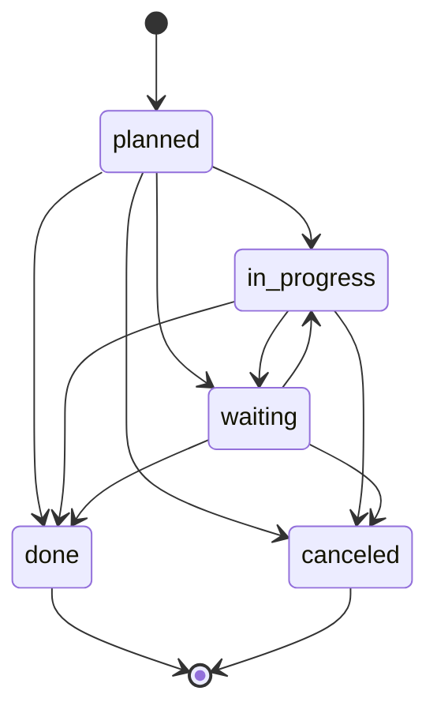
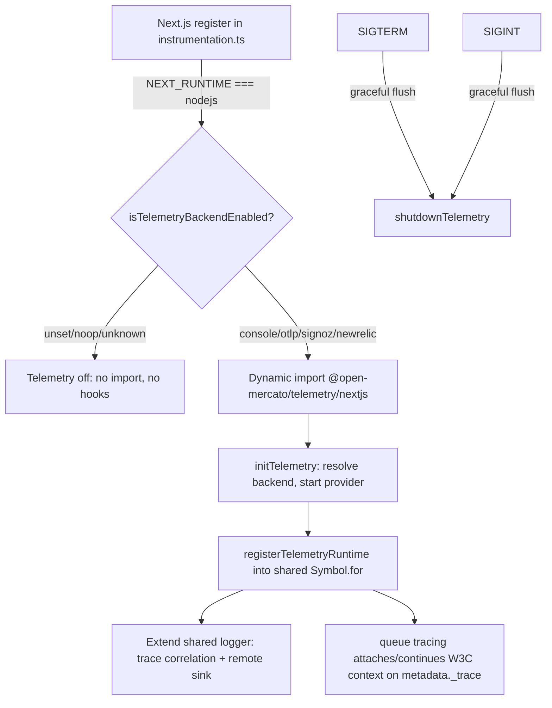
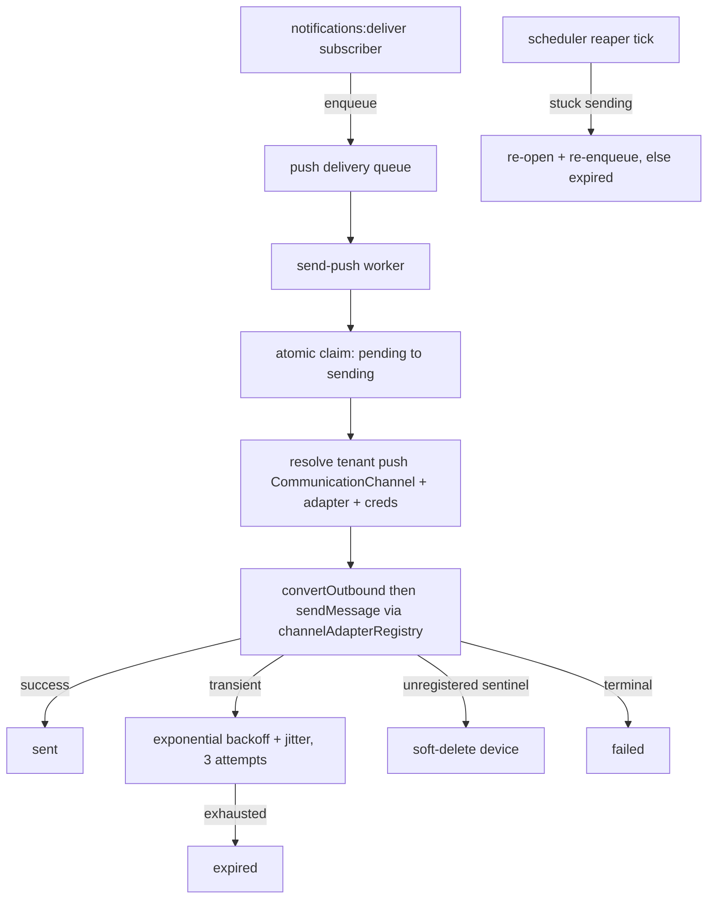

# Domain Modules

This page covers the major business domain modules in `packages/core/src/modules/`. Each module follows the convention-based structure described in [architecture/overview.md](../architecture/overview.md).

## Sales Module

**Path:** `packages/core/src/modules/sales/`
**AGENTS.md:** Present
**Dependencies:** `catalog`, `customers`, `dictionaries`

The most complex domain module. Manages the full quote-to-cash lifecycle: quotes, orders, invoices, credit memos, shipments, payments, returns, and payment allocations.

### Document Lifecycle
```
Quote → Order → Invoice
         ↓
    Shipments + Payments + Returns
```

- Quotes convert to orders; orders MUST NOT be created without a source quote (unless configured)
- Orders track shipments and payments independently
- Each entity has its own status workflow — states MUST NOT be skipped
- Credit memos created from invoices
- Returns generate line-level negative adjustments, update `returned_quantity`, recalculate order totals

### Key Business Rules

1. **Document math via DI service:** `salesCalculationService` handles all line/totals/tax calculations. Dispatches `sales.line.calculate.*` / `sales.document.calculate.*` lifecycle events so external calculators can hook in.
2. **Price resolution delegates to catalog:** Sales uses `selectBestPrice` and `resolvePriceVariantId` from the catalog module's pricing pipeline.
3. **Channel scoping:** All documents scoped to a sales channel — affects pricing tiers, document numbering sequences, admin UI visibility.
4. **Optimistic locking on the aggregate:** Sub-resources (lines, adjustments, shipments, payments, returns) guard against the **parent order's** `updated_at`, not their own. The order is the consistency boundary.
5. **Return quantity guards:** `computeAvailableReturnQuantity` caps at `min(quantity, shippedQuantity) - returnedQuantity` (if shipped) or `quantity - returnedQuantity` (if not shipped).
6. **Line total invariant:** `gross > 0 ⇒ net > 0` — if a line has positive gross but zero/missing net, the net is derived from gross and tax rate via `deriveLineNetFromGross`. Applied at every persistence site via `reconcileLinePersistedTotals`.
7. **Address snapshots:** Sales documents store their own `SalesDocumentAddress` rows (not FK to customer address) with optional `customerAddressId` reference. Preserves addresses at time of document creation even if the customer's address is later changed or deleted.
8. **Shipment quantity guard:** Cannot lower an order line's quantity below the shipped quantity (PR #4163).

### Code-Based Workflow
`workflows.ts` defines `sales.order-approval` — a USER_TASK-based approval workflow triggered by `sales.orders.created`. Steps: START → pending_approval (USER_TASK, SLA 24h) → approved/rejected (AUTOMATED, pre-conditioned by business rules) → END.

### Key DI Services
| Token | Purpose |
|-------|---------|
| `salesCalculationService` | Document math, lifecycle event dispatch |
| `taxCalculationService` | Tax calculations |
| `salesDocumentNumberGenerator` | Sequential document numbering |
| `salesOrderService` | Order-level operations |

### Source References
- `commands/documents.ts` — orders, quotes, invoices, credit memos
- `commands/shipments.ts`, `commands/returns.ts`, `commands/payments.ts`
- `commands/shared.ts` — `enforceSalesDocumentOptimisticLock`, `deriveLineNetFromGross`, `reconcileLinePersistedTotals`
- `lib/calculations.ts` — core calculation math
- `lib/returnQuantity.ts` — return availability computation
- `lib/shipments/snapshots.ts` — shipment item snapshots, `loadShippedQuantityByLine`
- `services/salesCalculationService.ts`, `services/taxCalculationService.ts`
- `workflows.ts` — order approval workflow definition

## Customers Module

**Path:** `packages/core/src/modules/customers/`
**AGENTS.md:** Present (9.3KB)
**Role:** Reference CRUD module — all new modules should copy patterns from here

Full CRM: people, companies, deals (sales opportunities), activities, todos, comments, addresses, tags, labels, entity roles, person-company links, and pipeline stages. Includes AI agents for deal analysis and account assistance.

### Data Model
| Entity | Constraints |
|--------|------------|
| People | MUST have name; email/phone optional but searchable |
| Companies | MUST have name; tax ID optional |
| Deals | MUST link to a person or company |
| Activities | MUST reference parent entity |
| Todos | MUST have assigned user |
| Comments | MUST reference parent entity |
| Addresses | Multi-address support, FK to person or company |

### Key Business Rules
1. **Custom field integration:** All CRUD operations wire custom field helpers. Custom field snapshots captured in command `before`/`after` payloads for undo support (`buildCustomFieldResetMap`).
2. **Transaction safety:** Multi-phase mutations use `withAtomicFlush(em, phases, { transaction: true })` — never interleave `em.find`/`em.findOne` between a scalar mutation and `em.flush()`.
3. **Primary address enforcement:** `enforcePrimaryAddress` sets `isPrimary = false` on all other addresses for the same entity.
4. **Deal lifecycle events:** `customers.deal.won` / `customers.deal.lost` beyond standard CRUD.
5. **Interaction projection:** `recomputeNextInteraction` recalculates the next scheduled open interaction when interactions are created, completed, canceled, or reverted. Only considers rows where `scheduled_at IS NOT NULL` and `status NOT IN (terminal set)`. Sort order: `scheduled_at ASC, priority DESC NULLS LAST, created_at ASC, id ASC`.
6. **Email integration:** `customers.email.linked` and `customers.email.visibility_changed` events for email channel linking.

### Interaction Unification (Activities → Interactions)

The customers module is undergoing a gradual unification of three legacy entities — `CustomerActivity`, `CustomerTodoLink`, and standalone tasks — into a single canonical `CustomerInteraction` model. This is controlled by per-tenant feature flags, not a hard cutover.

**Specs:**
- `.ai/specs/implemented/SPEC-046b-2026-02-27-customers-interactions-unification.md` — original unification
- `.ai/specs/2026-06-18-configurable-crm-interaction-statuses.md` — dictionary-backed interaction statuses
- `.ai/specs/2026-06-18-customers-interactions-legacy-removal.md` — planned legacy retirement

**Canonical entity (`CustomerInteraction`):** `packages/core/src/modules/customers/data/entities.ts` — supports interaction types (calls, meetings, tasks, emails), scheduling with recurrence, participants, visibility per type (`private`/`shared` for email, `team`/`public` for activities), soft-delete (`deleted_at`), pinning, and cross-module links (`external_message_id` for email channel integration).

**Feature flags** (`lib/interactionFeatureFlags.ts`): three per-tenant toggles resolved via `featureTogglesService`:
| Flag | Default | Purpose |
|------|---------|---------|
| `customers.interactions.unified` | `false` | Enables canonical-only read path |
| `customers.interactions.legacy-adapters` | `true` | Keeps legacy activity/todo bridges active |
| `customers.interactions.external-sync` | `false` | Enables external system sync |

**Legacy bridge** (`lib/legacyActivityBridge.ts`): `ensureCanonicalActivityBridge()` creates a canonical `CustomerInteraction` from a legacy `CustomerActivity` row on demand, reusing the legacy PK as the canonical ID. `resolveCanonicalActivityTargetId()` is called from the interactions API to transparently serve historical activities that haven't been migrated yet. The legacy `activities` command (`commands/activities.ts`) maps create/update inputs to the canonical interaction commands with `source: 'adapter:activity'`.

**Todo compatibility** (`lib/todoCompatibility.ts`): canonical task interactions (`interactionType: 'task'`) coexist with legacy `CustomerTodoLink` rows. `listCanonicalTodoRows()` queries `CustomerInteraction` with type `task`; `listLegacyTodoRows()` resolves legacy todo links via the Query Engine. Both map to a unified `CustomerTodoRow` shape. `mapInteractionRecordToTodoSummary()` and `mapInteractionRecordToActivitySummary()` in `lib/interactionCompatibility.ts` provide the read-model adapters.

**Configurable interaction statuses** (`lib/interactionStatus.ts`): statuses are dictionary-backed (`interaction-statuses` dictionary kind, managed via `/api/customers/dictionaries/interaction-statuses`). The open/terminal semantic is centralized in code: `isTerminalInteractionStatus()` treats `done`, `canceled`, and legacy `completed` as terminal; any unknown status counts as open (safe default for the open-activities badge). Default seeded set: `planned`, `in_progress`, `waiting`, `done`, `canceled`. The deals list enricher (`customers.deal-pipeline-state`) counts `_pipeline.openActivitiesCount` as interactions whose status is NOT in the terminal set.



Interaction status lifecycle — planned, in_progress, and waiting are open (non-terminal); done and canceled are terminal. The `complete` action always targets `done`; `cancel` always targets `canceled`.

**Interaction read model** (`lib/interactionReadModel.ts`): `hydrateCanonicalInteractions()` loads author names, deal titles, and custom field values for a set of `CustomerInteraction` rows, with optional response enrichment via `applyResponseEnrichers`. Uses `findWithDecryption` for encrypted fields.

**Calendar** (`lib/calendar/`): full calendar grid support — range queries (`from`/`to` filtering on `coalesce(occurred_at, scheduled_at, created_at)`), conflict detection (`mine`/`all` scope), recurrence expansion, preferences (weekends, conflict warnings, CRM activity visibility, event categories). Calendar preferences stored in `om.customers.calendar.preferences.v1` localStorage key. Source spec: `.ai/specs/2026-06-11-crm-calendar.md`.

**Interaction commands** (`commands/interactions.ts`): `customers.interactions.create`, `customers.interactions.update`, `customers.interactions.complete`, `customers.interactions.cancel` — all go through the command pattern with `withAtomicFlush`, optimistic locking on the parent entity, undo/redo snapshots, custom field snapshots, and `emitCrudSideEffects` post-commit. Events: `customers.interaction.created`, `.updated`, `.completed`, `.canceled`, `.reverted`, `.deleted`.

### Cross-Module Patterns
- **Widget injection:** AI assistant triggers on People/Companies list `:search-trailing` slots; deal analyzer on Deals list
- **Subscribers:** `reconcileOnCustomerDelete`, `reconcileOnCompanyDelete`, `reconcileOnAddressDelete` (cross-module to sales); `link-channel-message-received/sent` (email integration)
- **Search:** `search.ts` (44KB) demonstrates all three search strategies: `fieldPolicy`, `buildSource`, `formatResult`

## Catalog Module

**Path:** `packages/core/src/modules/catalog/`
**AGENTS.md:** Present

Product catalog with hierarchical categories, product variants, multi-tier pricing, time-limited offers, option schemas for variants, and unit conversions.

### Pricing Engine
`selectBestPrice` resolves ties via: **score** (descending) → **startsAt** (descending) → **minQuantity** (direction depends on whether tied rows share the same resolved kind).

Score formula (`scorePrice`): `custom > promotion > tier > regular` as base, plus bonuses for variant (+8), offer (+6), channel (+5), user (+5), userGroup (+4), customer (+4), customerGroup (+3), minQuantity > 1 (+1).

- Same-kind tie: higher `minQuantity` wins (volume discount semantic)
- Cross-kind tie: lower `minQuantity` wins (preserves kind precedence)
- Custom pricing resolvers registered with explicit priority: `registerCatalogPricingResolver(resolver, { priority })`
- Pipeline emits `catalog.pricing.resolve.before|after` events (excluded from triggers)

### Key Rules
1. Option schemas MUST NOT be deleted while variants reference them
2. Products MUST have at least a name
3. Categories are hierarchical — no circular references
4. Offers (promotional pricing) MUST have valid date ranges
5. AI mutation tools MUST route through `prepareMutation` + approval

## Entities Module

**Path:** `packages/core/src/modules/entities/`
**Requires:** `query_index`

EAV (Entity-Attribute-Value) system for custom/dynamic fields on any entity.

### Core Tables
- `custom_field_defs` — field definitions scoped by entity ID, organization, tenant
- `custom_field_values` — field values per record
- `custom_entities` — virtual entity registry (admin-created data types)
- `custom_entities_storage` — JSONB document store for virtual entity records
- `custom_field_entity_configs` — per-entity configuration

### Field Kinds
`text`, `multiline`, `integer`, `float`, `boolean`, `select`, `currency`, `relation`

### Admin UI
Backend → Data designer → System/User Entities. Entity definitions show field count; create/edit virtual entities. Per-field options depend on `kind`. Text/multiline fields support editor hints: `markdown`, `simpleMarkdown`, `htmlRichText`.

## Attachments Module

**Path:** `packages/core/src/modules/attachments/`
**AGENTS.md:** Present

File upload, storage drivers, partitions (public/private), OCR, thumbnail generation, PDF processing, image safety checks, text extraction.

### Scope Invariant (Critical Security Rule)
Two valid scope shapes:

| Shape | tenant_id | organization_id | Who can read |
|-------|-----------|-----------------|--------------|
| Scoped | set | set | Same-scope principals + superadmin |
| Global | null | null | Any authenticated principal (unauthenticated only on `is_public` partition) |
| Partial-null | one set, one null | — | **Invalid — nobody (fail-closed except superadmin)** |

- `assertAttachmentScopeInvariant()` throws on partial-null before persisting
- `checkAttachmentAccess()` gates every read; `isSameScope()` fails closed on partial-null

### Organization Reconciliation
`reconcileAttachmentOrganizations()` heals historical mis-scoped attachments by resolving parent record organization via the Query Engine. Idempotent, conservative (unresolved rows left as-is), tenant-scoped. Exposed as an upgrade action in the configs module.

### Request Scope
`resolveAttachmentOrganizationId()` uses `resolveOrganizationScopeForRequest` (cookie-driven, RBAC-validated) rather than `auth.orgId` alone, because `auth.orgId` is NOT selected-organization aware for non-superadmin principals. Ensures uploaded files land under the currently selected organization, not the uploader's home organization (issue #3765).

## Customer Accounts Module

**Path:** `packages/core/src/modules/customer_accounts/`
**AGENTS.md:** Present (20.6KB — most detailed)

Customer-facing identity and portal authentication. Fully separate from the internal `auth` module (staff). Manages customer user accounts, sessions, roles, invitations, and the authentication flow for the customer portal.

### Authentication Flows
- **Login:** Rate-limit → validate → lookup by email hash + tenantId → check active/not locked → verify bcrypt → lockout after 5 failures (15 min) → create session → sign JWT → set two cookies
- **Signup:** Rate-limit → validate → check duplicate → create user → assign default role → create email verification token → emit `customer_accounts.user.created`
- **Magic Link:** 15 min TTL
- **Password Reset:** 60 min TTL
- **Email Verification:** 24h
- **Invitation:** 72h TTL, admin creates with role pre-assignment

### Two-Cookie Strategy
| Cookie | Content | TTL |
|--------|---------|-----|
| `customer_auth_token` | Signed JWT with claims | 8 hours |
| `customer_session_token` | Raw session token | 30 days |

### Session Revalidation & Token Lifecycle

A signed `customer_auth_token` alone never authorizes a request. Every request revalidates the referenced session and user state before trusting the JWT:

1. **Audience verification** — `verifyAudienceJwt(CUSTOMER_JWT_AUDIENCE, token)` (`lib/customerAuth.ts:115`). A staff-audience JWT replayed into the `customer_auth_token` cookie is rejected outright; the session check is never reached.
2. **`sid` presence** — tokens without a `sid` claim are rejected, *unless* they are legacy tokens (below). Legacy/stolen sessionless tokens cannot survive this gate.
3. **Session-liveness revalidation** — `assertSessionStillActive()` resolves `customerSessionService` from the request container and calls **`findActiveSessionForClaims({ sessionId, userId, tenantId, organizationId })`** (`services/customerSessionService.ts:109`), not the older id-only `findActiveSessionById`. The claims-scoped lookup matches the session row against the JWT's `sub`/`tenantId`/`orgId` *and* the soft-delete/expiry predicates, so a session id valid for one customer identity or scope is null for another. If the lookup throws (degraded backend), the request **fails closed** — the token is treated as revoked to prevent replay of leaked JWTs.
4. **User-state validation** — `validateUserState()` (`lib/customerAuth.ts:59`) reloads `CustomerUser` from the DB and rejects soft-deleted, deactivated, or `sessionsRevokedAt`-stale users (a JWT minted before `sessionsRevokedAt` is dead).
5. **DB-resolved features** — `resolvedFeatures`/`isPortalAdmin` come from `CustomerRbacService.loadAcl` + `getEffectiveFeatures`, **never** from the JWT claims. A token claiming `portal.admin.all` still only gets the features the DB grants.

#### Legacy-token grace window

Pre-migration customer tokens signed with the raw `JWT_SECRET` (no `aud`/`iss`, no `sid`) are accepted only while `verifyJwt` still considers them legacy — it owns the grace window (`JWT_LEGACY_GRACE_MINUTES` / `JWT_LEGACY_CUTOVER_AT`) and marks the payload with `_legacyToken === true`. A legacy token inside the window **bypasses** the session check (it has no `sid`); once the window passes, or when `JWT_LEGACY_GRACE_MINUTES=0`, the same token is rejected. This is the only path that skips `findActiveSessionForClaims`. The equivalent server-component entrypoints are `getCustomerAuthFromCookies` (`lib/customerAuthServer.ts:54`) and the host-aware `getCustomerAuthForHost` (`lib/customerAuthServer.ts:117`); see the [Custom Domain Lifecycle](#custom-domain-lifecycle) for how the latter binds a host-resolved `expectedTenantId` and rejects cross-host replay.

The invariants above are pinned by the customer auth test suites — see [testing/guidance.md → Customer Portal Auth / Session Revocation](../testing/guidance.md#customer-portal-auth--session-revocation).

### RBAC Model (Two-Layer)
1. **Role ACLs** (`CustomerRoleAcl`) — features assigned to roles
2. **User ACLs** (`CustomerUserAcl`) — per-user overrides (takes precedence)

Default roles: Portal Admin (`portal.*`), Buyer, Viewer. Feature convention: `portal.<area>.<action>`. Wildcard matching: `portal.*` and `*` are first-class.

### CRM Auto-Linking
- **Forward** (`autoLinkCrm` subscriber on `customer_accounts.user.created`): Links new customer user to CRM person by email match
- **Reverse** (`autoLinkCrmReverse` on `customers.person.created`): Links new CRM person to existing unlinked customer user

### Security
- Passwords: bcrypt cost 10, min 8 / max 128 chars
- Tokens: `crypto.randomBytes(32)`, stored as SHA-256 hashes
- Emails: stored in plaintext but lookups use `hashForLookup` (deterministic hash)
- Error messages never confirm email existence
- Rate limiting: dual (per-email + per-IP)

### Custom Domain Lifecycle

The `customer_accounts` module owns the `DomainMapping` entity (`data/entities.ts`), which resolves a hostname to `(tenantId, organizationId, orgSlug)` for both the customer portal and the admin panel. A `target: 'portal' | 'backend'` discriminator (added in #4271) separates the two: portal mappings rewrite the request to `/{orgSlug}/portal`, while backend mappings pass through unrewritten so `/backend` resolves normally.

- **Status lifecycle:** `pending` → `verified` → `active`, with `dns_failed` and `tls_failed` failure states. Only `active` mappings bind or route.
- **DNS verification:** CNAME-first, then A-record fallback, then reverse-resolve over HTTPS (handles apex and Cloudflare-proxied domains).
- **TLS:** Traefik on-demand ACME (TLS-ALPN-01), gated by the app's `domain-check` endpoint (`ForwardAuth`).
- **Cache:** In-process stale-while-revalidate host cache (`apps/mercato/src/lib/customDomainCache.ts`), warmed on startup via `domain-resolve/all`.
- **Proxy:** `apps/mercato/src/proxy.ts` — platform host passes through; portal-target host rewrites to `/{orgSlug}/portal`; backend-target host passes through (when `backendCustomDomainsUsable()`); wrong-target path returns 404. The matcher excludes `/api/*` — API routes resolve the host themselves via `resolveRequestHostname`.
- **ACL:** `customer_accounts.domain.manage` (portal) and `customer_accounts.domain.manage_backend` (admin, #4271) — the latter is a higher privilege because a backend domain decides which organization an operator acts on.
- **Hostname uniqueness:** A global `UNIQUE` on `hostname` spans both targets (one hostname, one mapping). A partial unique index enforces one active backend domain per organization.

See [architecture/overview.md → Host Binding Org-Scope Clamp](../architecture/overview.md#host-binding-org-scope-clamp) for how a backend-target mapping authoritatively narrows organization scope, and [operations/runbook.md → Per-Organization Backend Domains](../operations/runbook.md#per-organization-backend-domains) for deployment.

## Messages Module

**Path:** `packages/core/src/modules/messages/`

Internal messaging system with attachments, actions, email forwarding, confirmations, and conversation threading.

### Message Types
- `default` — standard message with reply/forward
- `messages.confirmation` — requires confirmation action (terminal, `confirmRequired: true`)
- `messages.defaultWithObjects` — message with attached business objects

### Recipient Scoping
Messages scoped by `tenantId` + `organizationId`. Recipient mutations (`markRead`, `markUnread`, `archive`) load the message by `tenantId`, assert organization access, then load the `MessageRecipient` by `messageId + recipientUserId`. Organization access checked via `assertOrganizationAccess()`.

### Actions
Messages carry `actionData` with typed actions. Actions have `commandId` (executed via command bus), `href` (external link), or terminal flags. Action expiry computed from `actionData.expiresAt` or `messageType.actionsExpireAfterHours`.

## Workflows Module

**Path:** `packages/core/src/modules/workflows/`
**AGENTS.md:** Present (11.5KB)

Business process automation engine. See [key-workflows.md → Workflow Engine](../workflows/key-workflows.md#workflow-engine) for execution architecture details.

## Business Rules Module

**Path:** `packages/core/src/modules/business_rules/`

Rules engine for defining, managing, and executing business logic. Rules have conditions (evaluated by expression evaluator) and actions (executed by action executor).

### Rule Types
- `GUARD` — returns `allowed: true/false`, used as transition pre-conditions in workflows

### Action Types
`ALLOW_TRANSITION`, `BLOCK_TRANSITION`, `LOG`, `SHOW_ERROR`, `SHOW_WARNING`, `SHOW_INFO`, `NOTIFY`, `SET_FIELD`, `CALL_WEBHOOK`, `EMIT_EVENT`

### Execution Limits
- Max 100 rules per execution
- Max 30s per single rule
- Max 60s total execution
- 5-minute rule discovery cache TTL

### Cross-Module Coupling
Workflow module references rule IDs in transition `preConditions` (`{ ruleId: 'workflow_order_approval_check_approved', required: true }`).

## Dictionaries Module

**Path:** `packages/core/src/modules/dictionaries/`

Organization-scoped dictionaries for reusable enumerations. Each dictionary has a `key`, `name`, optional `description`, `isSystem` flag, `managerVisibility`, and `entrySortMode` (default `label_asc`).

### Cross-Module Usage
- Sales module: statuses (order, payment, shipment, line), payment/shipping methods, price kinds, adjustment kinds
- Customers module: interaction statuses, deal stages, pipeline stages
- `fields/dictionary.tsx` — reusable `DictionaryEntrySelect` component

## Directory Module

**Path:** `packages/core/src/modules/directory/`

Defines the multi-tenancy foundation: `tenants` and `organizations`.

### Organizations
- Hierarchical trees: `parentId`, `rootId`, `ancestorIds`, `descendantIds`
- Role- and user-level visibility controls
- `organizationScope.ts` — resolves the active organization scope from cookies + RBAC
- Stale org selection fails loud instead of orphaning writes (PR #3936)

## Configs Module

**Path:** `packages/core/src/modules/configs/`

Shared configuration storage, module settings, upgrade actions, system status, and cache management.

### Upgrade Actions
Version-keyed migration actions that run once per tenant/org. Tracked in `UpgradeActionRun` table. Gated by `UPGRADE_ACTIONS_ENABLED` env var. Actions are registered at boot time by modules; `configs` lazy-imports module code when actions run.

Examples: `attachments.reconcile-organization` (v0.6.6), `customers.seed-interaction-statuses` (v0.6.5).

## WMS Module (Warehouse Management)

**Path:** `packages/core/src/modules/wms/`
**Roadmap:** `.ai/specs/2026-04-15-wms-roadmap.md` (phases 1–5)
**Dependencies (FK IDs only, no ORM relations):** `catalog`, `sales`, `shipping_carriers`, `customers`

Warehouse topology, inventory balances, reservations, and an append-only movement ledger — the platform's first physical-execution inventory layer. Spec-first module delivered in five additive phases: core inventory, inbound/putaway, picking/packing, yard management, returns/reverse logistics.

### Entities
| Entity | Table | Role |
|-------|-------|------|
| `Warehouse` | `wms_warehouses` | Top-level warehouse record |
| `WarehouseZone` | `wms_warehouse_zones` | Subdivision of a warehouse |
| `WarehouseLocation` | `wms_warehouse_locations` | Putaway/pick bin |
| `ProductInventoryProfile` | `wms_product_inventory_profiles` | Per-product WMS configuration |
| `InventoryLot` | `wms_inventory_lots` | Lot/serial traceability unit |
| `InventoryBalance` | `wms_inventory_balances` | Live on-hand quantity per warehouse/location/product |
| `InventoryReservation` | `wms_inventory_reservations` | Soft-hold against a balance |
| `InventoryMovement` | `wms_inventory_movements` | Append-only ledger entry driving balances |
| `SalesOrderWarehouseAssignment` | `wms_sales_order_warehouse_assignments` | Binds a sales order to a fulfilling warehouse |

All entities extend `WmsScopedEntity` (tenant + organization scoped). WMS owns physical execution only — financial/document-calculation logic stays in `sales`; shipment lifecycle stays in `sales`/`shipping_carriers`.

### Append-Only Ledger Invariant
`InventoryMovement` rows are an **append-only ledger**: every balance change is a new movement row, never an in-place update of a prior row. `InventoryBalance` is the derived live state. This is why inventory-mutation commands are registered with `isUndoable: false` — a generic per-record undo cannot safely re-derive a point-in-time balance once later reservations/movements have been layered on top.

Reversal is exposed as an **explicit, auditable counter-action** in the domain instead of a generic undo verb:

| Action | Counter-action |
|--------|----------------|
| `reserve` | `release` |
| `allocate` | `release` (cancels allocation) |
| `adjust(+N)` | `adjust(-N)` |
| `receive` | `adjust` / RMA flow |
| `move(A → B)` | `move(B → A)` |
| `cycle count` | `cycle count` (re-recount) |

The audit log still captures full before/after via `buildLog`, so reversing counter-actions are fully traceable.

### Inventory Commands
`commands/inventory-actions.ts` registers: `reserveInventory`, `releaseInventoryReservation`, `allocateInventory`, `adjustInventory`, `receiveInventory`, `moveInventory`, `cycleCountInventory`. All use `LockMode` pessimistic locking on the affected balance row and emit CRUD side effects post-commit.

### Sales-Order Enrichment
WMS binds each sales order to a fulfilling warehouse via `commands/sales-order-assignment.ts`:
- `wms.sales-order.assign-warehouse` — creates the assignment
- `wms.sales-order.unassign-warehouse` — removes it
- `wms.sales-order.re-run-reservation` — re-runs reservation against the assigned warehouse (used after stock changes)

### Events
CRUD events per entity plus domain lifecycle events: `wms.inventory.received`, `.adjusted`, `.reserved`, `.released`, `.allocated`, `.moved`, `.reconciled`; and `wms.inventory.low_stock`, `.balance_drift`, `.reservation_shortfall`.

### ACL Features
`wms.view`, `wms.manage_warehouses`, `wms.manage_zones`, `wms.manage_locations`, `wms.manage_inventory`, `wms.manage_reservations`, `wms.adjust_inventory`, `wms.receive_inventory`, `wms.cycle_count`, `wms.import`.

### Source References
- `commands/inventory-actions.ts` — inventory mutation commands (undo policy header)
- `commands/sales-order-assignment.ts` — warehouse assignment + re-run reservation
- `commands/shared.ts` — scope helpers, `CrudIndexerConfig`, CRUD event configs
- `data/entities.ts` — all 9 entities
- `events.ts` — full event catalog
- `acl.ts` — RBAC feature declarations
- `.ai/specs/2026-04-15-wms-roadmap.md` — phased roadmap and invariants

## Communication Channels Module

**Path:** `packages/core/src/modules/communication_channels/`
**Spec:** SPEC-045d — unified Communications Hub bridging external chat/email channels to the Messages inbox.

Unified hub that bridges external chat and email channels (Slack, WhatsApp, Email) to the internal [Messages](#messages-module) inbox. Provider packages (`channel_gmail`, `channel_imap`, future providers) register adapters here; the hub picks them up by `providerKey`.

### Adapter Contract
Each provider implements a `ChannelAdapter` and registers it at import time in its package's `setup.ts`. The hub exposes a network-free stub adapter for tests (registered in `communication_channels/di.ts` when the test flag is set). Inbound messages land as `ExternalMessage` rows; outbound sends emit `communication_channels.message.sent` and `delivery_failed` events.

### Entities
| Entity | Table | Role |
|-------|-------|------|
| `CommunicationChannel` | `communication_channels` | A configured channel connection (per-user or tenant-wide) |
| `ExternalConversation` | `external_conversations` | A threaded external conversation, assignable to an operator |
| `ExternalMessage` | `external_messages` | Individual inbound/outbound message with channel-native payload |
| `MessageChannelLink` | `message_channel_links` | Links an external message to an internal `messages` record |
| `ChannelThreadMapping` | `channel_thread_mappings` | Maps external thread IDs to internal conversations |
| `MessageReaction` | `message_reactions` | Channel-native reactions |
| `ChannelThreadToken` | `channel_thread_tokens` | Per-thread access tokens |
| `ChannelIngestDeadLetter` | `channel_ingest_dead_letters` | Unprocessable inbound payloads (malformed MIME, etc.) |

### Events
`communication_channels.message.received`, `.sent`, `.delivery_failed`; `communication_channels.conversation.created`, `.reassigned`; `communication_channels.contact.resolved`; `communication_channels.channel.requires_reauth`, `.disconnected`, `.deleted`, `.primary_changed`; `communication_channels.reaction.added`, `.removed`; `communication_channels.push.registered`, `.failed`, `.renewed`, `.deactivated` (Gmail push subscription lifecycle).

### ACL Features
`communication_channels.view`, `.manage`, `.react`, `.assign`, `.connect_user_channel`, `.admin`, `.channel.import_history`, `.channel.push.manage`.

### Source References
- `index.ts` — module metadata
- `data/entities.ts` — all 8 entities
- `events.ts` — full event catalog
- `acl.ts` — RBAC feature declarations
- `di.ts` — adapter registration incl. test stub
- `extension-points.ts` — provider extension surface

## Telemetry Package

**Path:** `packages/telemetry/` — `@open-mercato/telemetry`
**Spec:** `.ai/specs/2026-04-29-telemetry-and-otel.md`
**AGENTS.md / README.md:** Present

Vendor-neutral observability — spans, metrics, error reporting, and a remote sink for the canonical shared logger. **Off by default:** the telemetry runtime is loaded only when `TELEMETRY_BACKEND` resolves to a non-`noop` provider (`console`, `signoz`, `newrelic`, `otlp`). The three OTLP names use the same exporter and differ only by endpoint + headers, so any OTLP backend is a one-line swap with no code change.

This is the canonical home for the telemetry concept; the package is referenced from [architecture/source-map.md](../architecture/source-map.md) and its env vars are listed in [operations/runbook.md → Environment Variables](../operations/runbook.md#environment-variables).

### Enablement and Invariants

- **Shared owns the gate:** `isTelemetryBackendEnabled()` lives in `@open-mercato/shared/lib/telemetry/runtime.ts` so hosts can decide whether to dynamically import the telemetry package without evaluating it. Unset / `noop` / unknown → absolute off.
- **Logger extension, never replacement:** Telemetry extends `@open-mercato/shared/lib/logger` with trace correlation and one remote sink after successful init; it must never introduce another logger or `stdout`/`stderr` path.
- **Cross-bundle state via `globalThis`:** provider, logger-bridge, and runtime-bridge state are stored on a process-global `Symbol.for` registry (`@open-mercato/shared.telemetryRuntime`), surviving HMR and bundle duplication.
- **No PII:** never emit PII, credentials, record content, SQL parameters, request bodies, or arbitrary thrown-object properties. Redaction applies at the provider boundary and at facade call sites.
- **Inbound trace trust is opt-in:** `traceparent` / `x-original-traceparent` are ignored at an inbound/global boundary unless `TELEMETRY_TRUST_INBOUND_TRACE=true`.
- **Span naming:** `module.entity.action` (lowercase, dot-separated). Tenant/organization/user IDs go on span **attributes**, never metric labels (low-cardinality labels only).

### Bootstrap and Runtime Flow



### Cross-Package Trace Propagation

- **Next.js bootstrap:** `apps/mercato/src/instrumentation.ts` `register()` calls `registerTelemetryForNextjs()`, which owns init + graceful degrade (never bubbles a rejection out of Next's `register()`) + best-effort flush on `SIGTERM`/`SIGINT`. The dynamic import is gated on `NEXT_RUNTIME === 'nodejs` because the OTEL NodeSDK is Node-only (incompatible with the edge runtime).
- **Queue tracing:** `packages/queue/src/tracing.ts` is the cross-boundary propagation seam. `attachTraceMetadata()` captures the active trace context onto a job's `metadata._trace` (a first-class metadata channel, not user payload); `runJobInTrace()` continues the producer's trace in a `queue.<queueName>` span at dispatch. Both halves are automatic and a cheap no-op when telemetry is off, so anything that rides the queue — persistent event subscribers (the [event bus](../workflows/key-workflows.md#event-bus) enqueues) and outbound webhook delivery — becomes part of the originating request's trace for free.
- **Events attribution:** the events bus attributes resource-usage telemetry to a module via the `moduleId` field on a subscriber (without it, telemetry falls back to guessing a module id).

### Providers

| Provider | `TELEMETRY_BACKEND` | Notes |
|----------|----------------------|-------|
| Noop | unset / `noop` / unknown | Off — no import, no hooks, no export traffic |
| Console | `console` | Local span/metric output |
| OTLP | `otlp` / `signoz` / `newrelic` | Same exporter; differ only by `OTEL_EXPORTER_OTLP_ENDPOINT` + `OTEL_EXPORTER_OTLP_HEADERS`. OpenTelemetry packages are optional deps imported only here, dynamically by `provider/otlp-provider.ts` |

### Source References
- `src/index.ts` — public facade exports
- `src/init.ts` — `initTelemetry()` / `shutdownTelemetry()`, backend resolution, bridge registration
- `src/env.ts` — `readTelemetryEnv()`, OTLP backend set
- `src/facade/` — `tracer.ts` (`withSpan`/`currentSpan`), `meter.ts`, `propagation.ts` (`captureTraceContext`/`continueTrace`), `redact.ts`, `report-error.ts`, `logger-bridge.ts`
- `src/provider/` — `registry.ts`, `noop-provider.ts`, `console-provider.ts`, `otlp-provider.ts`
- `src/nextjs.ts` / `src/nextjs-config.ts` — runtime vs build-time helpers
- `@open-mercato/shared/lib/telemetry/runtime.ts` — `isTelemetryBackendEnabled()`, `TelemetryRuntime` interface, `registerTelemetryRuntime()`
- `apps/mercato/src/instrumentation.ts` — Next.js `register()` bootstrap
- `packages/queue/src/tracing.ts` — `attachTraceMetadata()` / `runJobInTrace()`


## Other Core Modules

The remaining enabled modules in `packages/core/src/modules/` (and a few standalone packages) are smaller or single-concern. Each follows the standard [module conventions](../architecture/overview.md#module-system); the table gives the one-line responsibility and primary source anchor.

| Module | Path | Responsibility |
|--------|------|----------------|
| `auth` | `packages/core/src/modules/auth/` | Internal staff authentication (JWT sessions, users, roles, organizations). Distinct from `customer_accounts` (portal auth). |
| `directory` | `packages/core/src/modules/directory/` | Tenancy foundation — `tenants`, `organizations`, org-scope resolution. (See above.) |
| `dashboards` | `packages/core/src/modules/dashboards/` | Configurable admin dashboard layouts and widgets. |
| `perspectives` | `packages/core/src/modules/perspectives/` | Saved list views / perspectives per entity. |
| `entities` | `packages/core/src/modules/entities/` | EAV custom-field system. (See above.) |
| `configs` | `packages/core/src/modules/configs/` | Shared config storage, upgrade actions, system status, cache management. (See above.) |
| `query_index` | `packages/core/src/modules/query_index/` | Query engine over encrypted/decrypted fields; status-coverage waterfall diagnostics. |
| `audit_logs` | `packages/core/src/modules/audit_logs/` | Append-only audit trail of mutating operations. |
| `attachments` | `packages/core/src/modules/attachments/` | File uploads, storage drivers, OCR, thumbnails. (See above.) |
| `catalog` | `packages/core/src/modules/catalog/` | Product catalog, categories, variants, pricing. (See above.) |
| `sales` | `packages/core/src/modules/sales/` | Quote-to-cash lifecycle. (See above.) |
| `customers` | `packages/core/src/modules/customers/` | CRM (people, companies, deals, interactions, calendar). (See above.) |
| `customer_accounts` | `packages/core/src/modules/customer_accounts/` | Customer portal identity, auth, custom domains. (See above.) |
| `devices` | `packages/core/src/modules/devices/` | Per-tenant user device registry (`UserDevice`): platform/app/OS metadata, push-token storage scoped per (tenant, org, user, device). Requires `auth`. |
| `push_notifications` | `packages/core/src/modules/push_notifications/` | Push delivery rails — the `push` notification delivery strategy, delivery log, `send-push` worker, and stuck-row reaper. Fans out to `devices` tokens and sends through the [Communication Channels](#communication-channels-module) hub. (See below.) |
| `warranty_claims` | `packages/core/src/modules/warranty_claims/` | B2B warranty, RMA, core-return, and vendor-recovery claims desk. Claim aggregate with line-level partials/dispositions, SLA pause/escalation, risk signals & auto-adjudication (default OFF), portal intake, and sales-order tab injection. (See below.) |
| `eudr` | `packages/core/src/modules/eudr/` | EU Deforestation Regulation compliance: product commodity mappings, supplier origin evidence, due diligence statements, plots, risk assessments, mitigation actions. (See below.) |
| `documents` | `packages/documents/src/modules/documents/` | Collaborative internal documents (TipTap + Yjs) with a Hocuspocus WebSocket sidecar. Requires `auth`, `directory`, `attachments`. (See below.) |
| `portal` | `packages/core/src/modules/portal/` | Customer portal frontend extension. Documented in UI `AGENTS.md`; not yet synthesized (see backlog). |
| `wms` | `packages/core/src/modules/wms/` | Warehouse & inventory execution. (See above.) |
| `api_keys` | `packages/core/src/modules/api_keys/` | Scoped API keys for programmatic access. |
| `dictionaries` | `packages/core/src/modules/dictionaries/` | Organization-scoped reusable enumerations. (See above.) |
| `currencies` | `packages/core/src/modules/currencies/` | Currency definitions and exchange rates. |
| `planner` | `packages/core/src/modules/planner/` | Availability schedules, rulesets, and shared planning rules. |
| `resources` | `packages/core/src/modules/resources/` | Assets/resources with scheduling policies. |
| `staff` | `packages/core/src/modules/staff/` | Staff records and scheduling (timesheets). AGENTS.md present. |
| `shipping_carriers` | `packages/core/src/modules/shipping_carriers/` | Carrier adapter hub: rates, shipment creation, tracking, webhooks. |
| `notifications` | `packages/core/src/modules/notifications/` | In-app notifications with module-extensible types and actions. |
| `progress` | `packages/core/src/modules/progress/` | Generic server-side progress tracking for long-running operations (SSE). AGENTS.md present. |
| `translations` | `packages/core/src/modules/translations/` | Entity translation storage and locale overlay for CRUD responses. |
| `feature_toggles` | `packages/core/src/modules/feature_toggles/` | Per-tenant feature flags consumed by modules (e.g., interaction unification). |
| `business_rules` | `packages/core/src/modules/business_rules/` | Rules engine. (See above.) |
| `workflows` | `packages/core/src/modules/workflows/` | Workflow engine. (See above.) |
| `messages` | `packages/core/src/modules/messages/` | Internal messaging. (See above.) |
| `communication_channels` | `packages/core/src/modules/communication_channels/` | External channel hub. (See above.) |
| `inbox_ops` | `packages/core/src/modules/inbox_ops/` | Receives forwarded emails via webhook, extracts structured action proposals using an LLM, presents them for human-in-the-loop approval. |
| `integrations` | `packages/core/src/modules/integrations/` | Integration Marketplace registry (provider cards, credentials). |
| `data_sync` | `packages/core/src/modules/data_sync/` | Data sync hub (source/dest adapters, sync runs). AGENTS.md present; full workflow deferred (see backlog). |
| `sync_excel` | `packages/core/src/modules/sync_excel/` | File-upload CSV import built on the data_sync hub. |
| `payment_gateways` | `packages/core/src/modules/payment_gateways/` | Payment gateway adapter contract, registry, transaction tracking, webhook routing. Integrates with `sales` payment methods and `gateway_stripe`. |
| `design_system` | `packages/core/src/modules/design_system/` | Live DS component gallery at `/backend/design-system` (feature-gated by `design_system.view`). |
| `api_docs` | `packages/core/src/modules/api_docs/` | In-app API documentation browser. |
| `scheduler` | `packages/scheduler/src/modules/scheduler/` | Database-managed scheduled jobs. See [workflows/key-workflows.md → Scheduled Jobs](../workflows/key-workflows.md#scheduled-jobs). |
| `search` | `packages/search/src/modules/search/` | Search module (fulltext/vector/token). See [integrations/overview.md → Search Providers](../integrations/overview.md#search-providers). |
| `events` | `packages/events/` | Event bus runtime module. See [workflows/key-workflows.md → Event Bus](../workflows/key-workflows.md#event-bus). |
| `ai_assistant` | `packages/ai-assistant/` | AI assistant module. See [integrations/overview.md → AI Assistant](../integrations/overview.md#ai-assistant). |
| `telemetry` | `packages/telemetry/` | Vendor-neutral OTel/OTLP observability (off by default). See [Telemetry Package](#telemetry-package) above. |
| `onboarding` | `packages/onboarding/` | Setup wizards, tenant provisioning hooks. |
| `content` | `packages/content/` | Static content pages (privacy, terms, legal). |

## Push Notifications Module

**Path:** `packages/core/src/modules/push_notifications/`
**AGENTS.md:** Present
**Spec:** `.ai/specs/2026-04-28-push-notifications-and-devices.md`
**Requires:** `auth`, `devices`, `notifications`, `communication_channels`, `integrations`

Push delivery **rails** — the `push` notification delivery strategy, delivery log, `send-push` worker, and a stuck-row reaper. It deliberately owns **only** delivery: device tokens live in `devices`, per-user opt-out in `notifications`, and provider credentials/transport in the [communication_channels](#communication-channels-module) hub plus the channel packages (`channel_apns`, `channel_expo`, `channel_fcm`).

### Delivery Flow



### Key Invariants
- **Strategy only enqueues** — runs inside the persistent `notifications:deliver` subscriber; the actual send happens in the worker so a slow provider never blocks notification creation. Opt-out is enforced upstream, once, by the notifications create-time `shouldDeliver` gate; the `push` strategy no longer re-checks.
- **At-least-once with atomic claim** — `pending → sending` means a redelivered job is processed once; retries use exponential backoff + jitter (3 attempts, shared `@open-mercato/shared/lib/delivery/retry`).
- **Terminal vs retryable failure** — `failed` for terminal errors (e.g. `channel_unavailable`, `no_adapter`); `expired` once retries are exhausted. `push_notifications.delivery.failed` fires on **every** failed attempt and carries `willRetry: true` when another attempt is scheduled — subscribers counting ultimately-failed deliveries MUST filter to `willRetry !== true`.
- **Stuck-row reaper** — a per-tenant `@open-mercato/scheduler` interval (registered best-effort in `setup.ts`) recovers rows stranded in `sending` by a crashed worker, since the claim only matches `pending`. Reclaims past `OM_PUSH_STUCK_RECLAIM_MINUTES` (default 5); each transition is an atomic `nativeUpdate` guarded on `status='sending'` + still-stale `updated_at` so overlapping ticks or a re-claimed worker never re-open an active delivery. Batch-bounded by `OM_PUSH_STUCK_RECLAIM_BATCH_LIMIT` (default 500, oldest-stuck first).
- **Fan-out (`lib/push-fanout.ts`)** — shared device-resolution + provider routing + delivery-row insert + enqueue; preference-agnostic. Its channel/device short-circuits (no push channel / no devices / no provider match → `{ enqueued: 0 }`) are push's authoritative "is push set up" check.

### Source References
- `lib/push-delivery-strategy.ts` — `push` strategy registration (notifications `delivery-strategies` generator plugin)
- `workers/send-push.worker.ts` → `lib/push-delivery.ts` — send path, claim, retry
- `lib/push-fanout.ts` — `fanOutPushDeliveries` device resolution + routing
- `lib/push-reaper.ts` → `workers/reclaim-stuck.worker.ts` — stuck-row recovery
- `lib/queue.ts` — `createModuleQueue`, `enqueuePushDelivery`, local-worker bootstrap
- `events.ts` — `push_notifications.delivery.sent` / `.failed`

## Warranty Claims Module

**Path:** `packages/core/src/modules/warranty_claims/`
**AGENTS.md:** Present
**Spec:** `.ai/specs/2026-07-03-warranty-rma-claims-desk.md`

B2B warranty, RMA, core-return, and vendor-recovery claims desk. Owns the claim aggregate, line-level partials with dispositions, receiving & grading, SLA pause/escalation, risk signals & adjudication, registrations & vendor recovery, portal + API-key intake, and resolution-execution bridges into `sales`.

### Key Invariants
- **Frozen status enum + state machine** — lifecycle transitions live in `lib/stateMachine.ts` + `data/constants.ts`; moves MUST go through `warranty_claims.claim.transition`, never generic `PUT`. `closed → in_review` is the reopen path; `cancelled` is terminal.
- **Lines are first-class partials** — line create/update/delete MUST recompute header money rollups inside the same atomic flush.
- **SLA is settings-driven** (`lib/settings.ts`) — `info_requested` pauses when configured and resume shifts the due date instead of shortening the window.
- **Auto-adjudication default OFF**, risk-gated by `lib/risk.ts`, executed only inside the submit command path, limited to auto-approval — never auto-deny. Risk signals are deterministic, tenant/org scoped, code-constant based.
- **Event split** — `warranty_claims.claim.status_changed` is the staff/client broadcast and MUST NOT pin `recipientUserIds`; `warranty_claims.claim.portal_status_changed` is the portal broadcast and MUST pin customer-user recipient ids (skips emit when none).
- **Coupling via FK-id + snapshot** to `sales`, `customers`, `catalog`, `auth` — never direct ORM relations; optional peer lookups use QueryEngine or scoped decrypted lookups wrapped in `try/catch`.
- **Optimistic locking on by default** for CRUD and settings; action endpoints use `enforceCommandOptimisticLock`; UI line mutations send each line's own `updatedAt`.
- Free-text/correspondence fields are encrypted (`encryption.ts`) and excluded from search sources.

### Events (selection)
`warranty_claims.claim.created/.updated/.submitted/.status_changed/.portal_status_changed/.assigned/.comment_added/.sla_at_risk/.sla_breached/.escalated`, `warranty_claims.registration.created`, `warranty_claims.claim_line.quarantined`, `warranty_claims.claim.return_label_created`.

## EUDR Compliance Module

**Path:** `packages/core/src/modules/eudr/`
**Spec:** `.ai/specs/2026-07-06-eudr-compliance-module.md`

EU Deforestation Regulation compliance. Entities: product commodity mappings, supplier origin evidence submissions, due diligence statements, plots, risk assessments, mitigation actions. Lifecycle events: `eudr.due_diligence_statement.submitted/.reference_issued/.withdrawn`, `eudr.risk_assessment.concluded`. ACL features split into `eudr.mappings`, `eudr.submissions`, `eudr.statements` view/manage pairs. Couples to `catalog` (product mappings) and `customers` (supplier evidence) via FK-ids and QueryEngine lookups.

## Documents Module

**Path:** `packages/documents/` — `@open-mercato/documents`
**Module:** `packages/documents/src/modules/documents/`
**Spec:** `.ai/specs/2026-07-08-documents-collaborative-editor.md`
**Requires:** `auth`, `directory`, `attachments` (not ejectable until the collaboration sidecar can load an app-ejected implementation)

Tenant/organization-scoped backoffice module where staff co-author rich-text documents in real time (TipTap + Yjs), organized in folders, shared per-document (owner / editor / commenter / viewer), annotated with inline comments + @mentions, versioned, and exported to `.docx`/PDF.

### Collaboration Sidecar
Real-time editing is served by a **Hocuspocus WebSocket sidecar** — a separate long-lived Node process, **not** a Next.js route (App Router route handlers can't hold long-lived sockets). Entry: `packages/documents/server/documents-collab-server.ts`.

- The sidecar bootstraps the app's module registry + ORM via `bootstrapFromAppRoot()` (the same path the `mercato queue worker` fleet uses), then opens a fresh request-scoped container per document load/store so every query is tenant/org-scoped.
- `NEXT_PUBLIC_DOCUMENTS_COLLAB_URL` points the browser at the reachable `ws://`/`wss://` endpoint. When unset, users with edit capability get an optimistic-locked single-user autosave fallback; read-only/commenter users stay fail-closed. PostgreSQL remains authoritative in both modes.
- `DOCUMENTS_COLLAB_PORT` (default `4101`) is the sidecar listen port. The create-app Docker Compose templates include a `documents-collab` service.

Run: `yarn documents:collab` (dev: `yarn workspace @open-mercato/documents collab`). See [operations/runbook.md → Documents Collaboration Sidecar](../operations/runbook.md#documents-collaboration-sidecar) for deployment.

## Cross-Module Coupling Patterns

Modules connect through five mechanisms — never via direct ORM relations:

1. **Event bus** — typed events via `createModuleEvents()`, `clientBroadcast` for SSE, `excludeFromTriggers` for lifecycle events
2. **Widget injection** — declarative spot IDs (`data-table:<entity>:<slot>`, `detail:<entity>:<slot>`, `crud-form:<entity>:<slot>`)
3. **Foreign key IDs** — modules reference each other via entity ID strings (`<module>:<entity>` format) and FK columns, not ORM relations
4. **DI service resolution** — cross-module services resolved by DI token (e.g., `salesCalculationService`, `workflowExecutor`, `moduleConfigService`)
5. **Subscribers** — persistent event subscribers bridge modules (e.g., `reconcileOnCustomerDelete` → sales, `autoLinkCrm` → customers)
